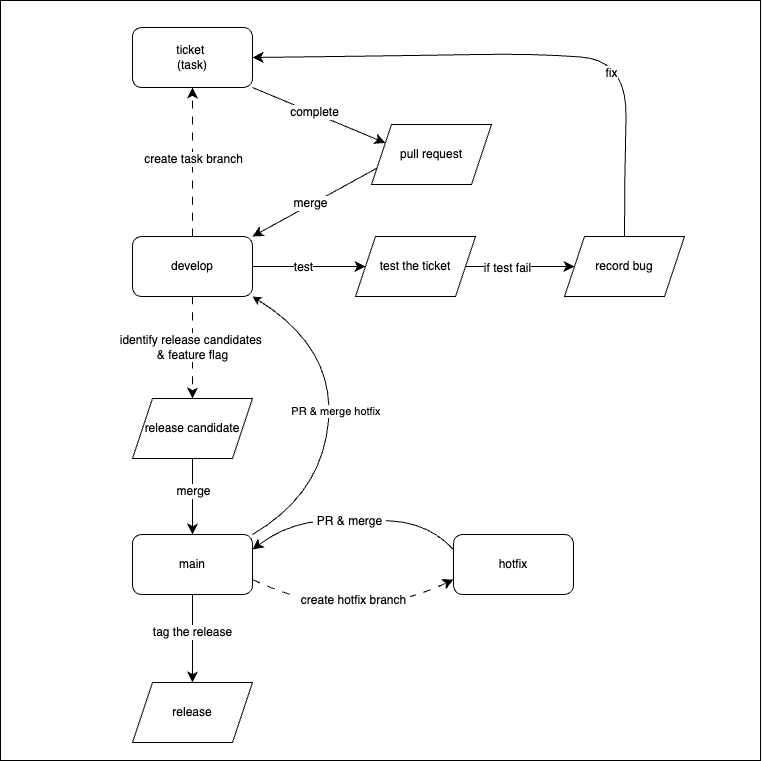

# Guide: Git Branching Strategy

- [Guide: Git Branching Strategy](#guide-git-branching-strategy)
  - [Git branching strategy diagram](#git-branching-strategy-diagram)
  - [Branch naming conventions](#branch-naming-conventions)
  - [To start work on a new ticket](#to-start-work-on-a-new-ticket)
  - [To test a ticket](#to-test-a-ticket)
  - [Identify release candidates](#identify-release-candidates)
  - [Once release candidates are merged to main](#once-release-candidates-are-merged-to-main)
  - [Hotfix process](#hotfix-process)
  - [Rebase](#rebase)
  - [References](#references)

## Git branching strategy diagram

## Branch naming conventions

- We prefer task over 'feature' as task better encapsulates the short-lived nature of transient branches.
- It is a task to be delivered (on the way to delivering a full feature) rather than the full feature.
- Consequently temporary branches created from main should follow this naming pattern: `task/JIRA_REF_Min_three_word_desc`
  - Where the minimum three word description starts with an initial capital
  - And the max length for a branch name is 60 characters.

- Valid branch names would be
  - `task/DR_1_Update_s3_terraform`
  - `task/DR_9_Add_new_data_item`

- Invalid branch names might be
  - `feature/DR_1_Update_s3_terraform` (doesn't start with task)
  - `task/DR-1_Update_s3_terraform` (Jira ref doesn’t use underscore)
  - `task/Update_s3_terraform` (doesn't include Jira ref)
  - `task/DR_1_update_s3_terraform` (first word after Jira ref not capitalised)

## To start work on a new ticket

- Create a new task branch from develop
- When development is complete, then create a pull request to merge back into develop.

## To test a ticket

- Complete testing of the ticket on the develop branch
- If there are test failures, should that be:
  - Fixed within the current ticket (since QA is not met)?
  - Or should that be a bug ticket?
- (To clarify, in the diagram earlier, “record bug” could mean
  - To comment on ticket and resolve as part of that ticket, by addressing fixes in a follow up PR using same branch?
  - Or, to create a new ticket to make the fixes on a new branch?)

## Identify release candidates

- The team will identify the tickets and their subsequent commits for to include in the release
- A confluence document records the tickets included for the release
- Merge the subsequent commits into main
- Where relevant, use feature flagging to merge code to main but in the “off” position

## Once release candidates are merged to main

- Tag main with the release version.

## Hotfix process

- Used when any issue(s) on main requires an urgent fix
- Create a hotfix branch from main
- Create and merge the PR into main
- Once the hotfix has been deployed, then merge the hotfix into the develop branch

## Rebase

- If you need to update a task branch with updates pushed to main since you created your branch, then rebase - do NOT merge main into your branch.
- This results in a cleaner commit history and usually makes code easier to review

## References

- [Atlassian gitflow workflow](https://www.atlassian.com/git/tutorials/comparing-workflows/gitflow-workflow)
- [Software engineering quality framework](https://github.com/NHSDigital/software-engineering-quality-framework/blob/main/patterns/little-and-often.md)
